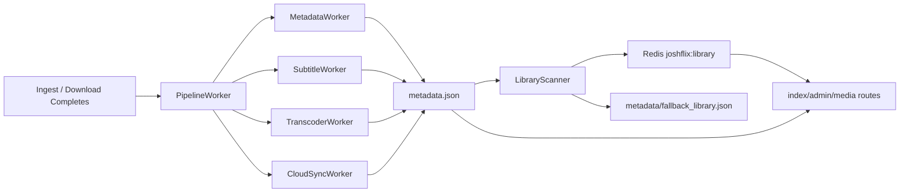

# Metadata Flow

This project treats `metadata.json` as the source of truth for a title on disk. Redis stores a derived library snapshot built from those files.

## High-Level Flow



## What Writes What

### MetadataWorker
- Fetches OMDb data.
- Downloads poster artwork.
- Returns `patchData` for the pipeline to persist.
- Adds core enrichment fields such as `genre`, `tags`, `imdbScore`, `parentalRating`, and `popularity`.

### PipelineWorker
- Receives worker `patchData`.
- Merges it into the title’s `metadata.json` on disk.
- Advances `pipelineState`.
- Triggers `LibraryScanner.runLibraryScanSweep()` after major stages.

### LibraryScanner
- Walks the movie and series mount points.
- Reads each `metadata.json` from disk.
- Normalizes metadata into the library snapshot.
- Writes the snapshot to Redis through `syncLibraryToStorage()`.

### db.js
- Writes the derived library snapshot to Redis key `joshflix:library`.
- Also writes a JSON fallback copy for recovery.

## Current Metadata Shape

The title file keeps legacy top-level fields for compatibility, plus an organized enrichment block.

```json
{
  "title": "Avengers: Age of Ultron",
  "year": "2015",
  "plot": "...",
  "genre": "Action, Adventure, Sci-Fi",
  "imdbId": "tt2395427",
  "tags": ["Action", "Adventure", "Sci-Fi"],
  "imdbScore": "7.3",
  "parentalRating": "PG-13",
  "popularity": "1,234,567",
  "enrichment": {
    "genre": "Action, Adventure, Sci-Fi",
    "tags": ["Action", "Adventure", "Sci-Fi"],
    "imdbScore": "7.3",
    "parentalRating": "PG-13",
    "popularity": "1,234,567",
    "popularitySource": "imdbVotes"
  },
  "storage": {
    "location": "remote",
    "files": {
      "1080p": {
        "status": "synced",
        "localPath": "Avengers.Age.of.Ultron.2015.1080p.BluRay.x264.YIFY.web.mp4",
        "remoteKey": "movies/tt2395427/1080p.mp4"
      }
    }
  }
}
```

## Organized Metadata vs Analytics

Keep these categories separate:

- `metadata.json`: title-level truth and enrichment that belongs with the asset.
- External analytics store: correlations, recommendations, embeddings, graph/vector features, user behavior, and future derived signals.

Recommended split:

- Store stable media facts in `metadata.json`.
- Store analysis results elsewhere and join by `imdbId`, `folderPath`, and `contentType`.
- Use `metadata.enrichment` for raw facts that help analytics later, but do not store model outputs there.

## File Map

- [src/services/workers/MetadataWorker.js](../src/services/workers/MetadataWorker.js)
- [src/services/workers/PipelineWorker.js](../src/services/workers/PipelineWorker.js)
- [src/services/LibraryScanner.js](../src/services/LibraryScanner.js)
- [src/services/db.js](../src/services/db.js)
- [src/routes/admin.routes.js](../src/routes/admin.routes.js)
- [src/routes/media.routes.js](../src/routes/media.routes.js)

## Practical Rule

If a field should survive a refresh, repair, or rescan, it belongs in `metadata.json`.
If a field is derived from analytics, it belongs outside the media folder and can be recomputed later.